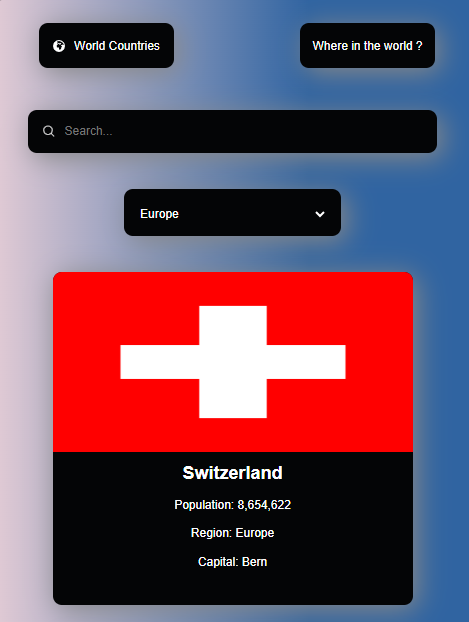
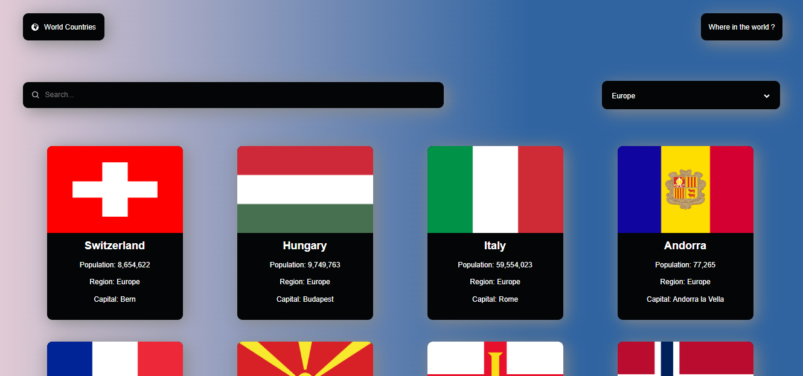

# 🌍 Rest Countries API with Color Theme Switcher (React.js)

This is a **React.js web application** that fetches country data from the **REST Countries API** and displays it in a beautifully designed interface. The app allows users to **search for countries, filter by region**.  

## 🚀 Features

✅ **Built with React.js** ⚛️  
✅ Fetches **real-time country data** from the **[REST Countries API](https://restcountries.com/)** 🌍  
✅ Displays essential details like:  
   - Name 🇺🇳  
   - Flag 🏳️  
   - Capital 🏛️  
   - Population 👥  
   - Region & Subregion 🌎  
✅ **Search bar** for finding specific countries 🔍  
✅ **Filter by region** to sort countries 🌍  
✅ **React Router** for country detail pages 🛤️  
✅ **Fully responsive design** 📱💻  

---

## 🛠️ Technologies Used

- **React.js** - Frontend framework  
- **React Router** - For navigation and dynamic routing  
- **Styled Components / CSS** - For styling  
- **Axios / Fetch API** - For making API requests  
- **REST Countries API** - Fetches real-time country data  

---

## 📸 Screenshots

### 🏠 Home Page (Mobile)


### 🌙 Home Page (Desktop)


---

## 🔧 Installation & Setup

1. **Clone the repository**  
   ```bash
   git clone https://github.com/your-username/rest-countries-api-with-color-theme-switcher-master.git

